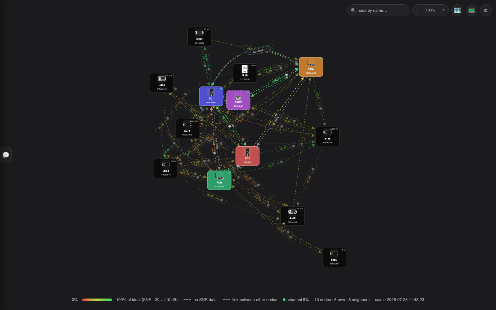
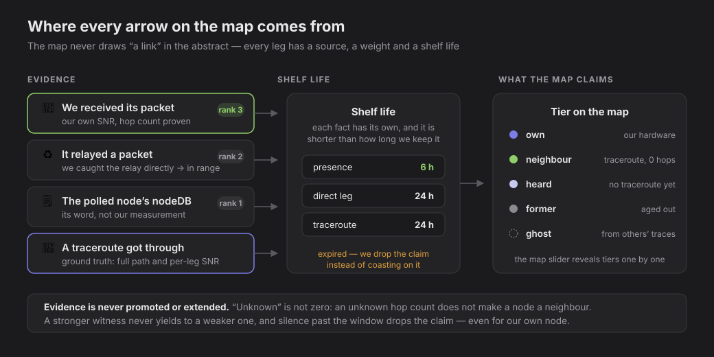
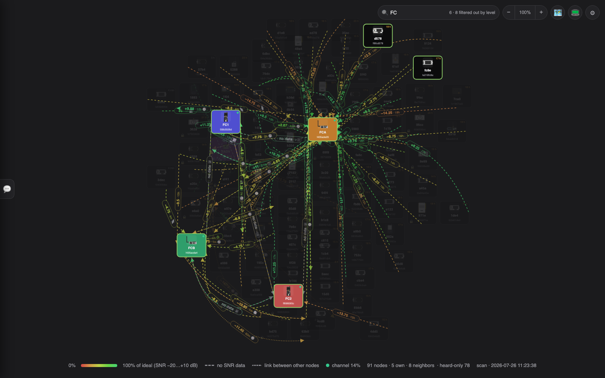
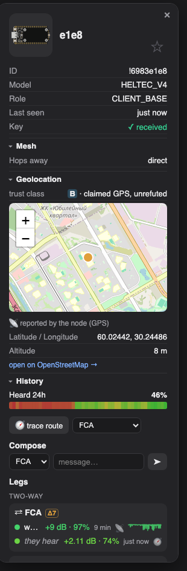
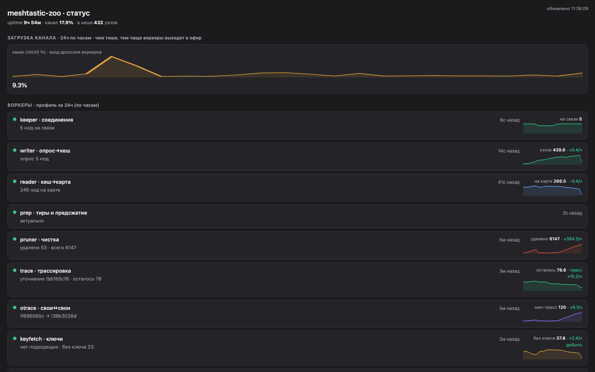

# meshtastic-zoo 📡

**English** | [Русский](README.ru.md)

A live map of your Meshtastic node zoo: who is on the air, who hears
whom and how well, and which node has unread mail. Everything updates
by itself while the page is open.



*(All doc shots are taken in the built-in anonymize mode: neighbours'
names are replaced with their id tails, own nodes' IPs are hidden.)*

## Running

Quick, for a look:

```sh
pip install meshtastic
python3 collector/hub.py
# the map: http://localhost:8814
```

One process does it all: keeps in touch with your nodes, listens to the
air, refreshes the map and serves the site. Which subnets count as yours
is a list in `collector/config.json`.

### On a server (systemd)

Put it on an always-on box that can reach your nodes (same LAN). One line —
`install.sh` clones the repo (into `/opt/meshtastic-zoo`), makes a venv,
installs the dependency, seeds `config.json` from `config.example.json`,
and registers a `meshtastic-zoo` systemd service:

```sh
curl -fsSL https://raw.githubusercontent.com/anton-vinogradov/meshtastic-zoo/main/install.sh | bash
# or, running as root:  … | sudo bash
```

Re-run the same line to update (it's idempotent and git-pulls itself). Or,
from a clone (works for a private repo without piping to a shell):

```sh
git clone <repo-url> meshtastic-zoo && cd meshtastic-zoo && ./install.sh
```

The one-liner needs the repo reachable by `git clone` — public, or with a
credential helper configured on the server. `config.json` is per-install
(git-ignored) and `config.example.json` is a generic template, so nothing
private ships in the repo and updates never clobber your ⚙ settings. On
first run, set your subnets in the ⚙ panel. Logs:
`journalctl -u meshtastic-zoo -f`.

## What's on the map



Every arrow is a claim, and the map keeps the receipts: what produced it,
how much that source is worth, and when the claim expires. Unknown is never
rounded to zero, a stronger witness never yields to a weaker one, and
silence past the window drops the claim — including for your own node.

- **Node tokens**: a device photo, name and address. Your own nodes are
  tinted **by subnet** — each site gets its own color, which you can
  change in settings; black ones are neighbors heard over the radio.
- **A green dot** — the node is online right now. A "N min / h" badge —
  how long ago it was last heard on the air (orange when older than
  3 hours).
- **An envelope ✉** — the node has an unread direct message. The
  overall mail counter sits in the top-left corner; clicking it opens
  the node with the letter.
- **A lock 🔒** — the node's public key hasn't been received yet, so an
  encrypted DM to it can't be sent (the `PKI_SEND_FAIL_PUBLIC_KEY`
  error). The key is held **per sending node**: a DM only goes through
  from one of your nodes that already has the recipient's key, so the
  panel lists exactly which of your nodes hold it. Keys arrive on their
  own with NodeInfo; the badge disappears once every node has one. When a
  key is missing, the panel says **why** — the node doesn't publish one
  (old firmware), the entry was evicted from its 250-slot LRU database
  (asking brings it back), or we've never seen it — and offers a
  **request key** button; a background worker also collects keys on its
  own, nearest neighbours first.
- **The detail slider** (in ⚙) reveals the map tier by tier: **own** →
  **+trace ✓** (neighbours confirmed by a traceroute that got through, or
  by relaying our own packet) → **+heard** (direct reception exists but
  no confirmation: relayed copies are good at posing as direct, so
  "heard" is not yet "neighbour") → **+former** (grey with a dashed
  frame: now reached over relays — the leg shows a hop count instead of
  an SNR — or gone silent entirely; kept for up to an hour, then
  forgotten) → **+ghosts**.
- **Ghosts 👻** — nodes your fleet never hears at all: they showed up
  inside other people's traceroutes next to nodes whose positions are
  known. A dashed card with a presence age; legs to partners are dashed,
  with no measurement. If the node broadcast its own GPS, that wins over
  our guess (a centroid of partners physically cannot land outside their
  cloud). A day of silence (`ghostWindowH`) and the ghost is gone.
- **Presence.** "Neighbour" is a claim about now: silence longer than 6
  hours (`proofSilentH`, counted across any evidence — reception, a
  traceroute that got through, a relay of our packet) drops the
  confirmation. Your own silent node keeps its own-style card, but its
  legs collapse into a single dashed one — a trace of the last known
  adjacency instead of eight confident arrows.
- **Arrows** show who hears whom: the head points at the listener.
  Color is link quality, from red (barely) to green (ideal). The label
  on the line is the SNR in dB, the measurement age and a **source
  icon**: 📡 we received its packet ourselves · ♻ relay-byte harvest
  (the node relayed someone else's packet and we caught that directly) ·
  🗒 the polled node's own database · 🧭 traceroute · 👥 NeighborInfo ·
  ∅ drawn for symmetry. The exact percentage and the wording are in the
  tooltip; the suffix can be turned off in ⚙. A grey "no data" arrow
  means that direction has never been caught.
- **Distance = quality.** The better a pair hears each other, the
  closer their tokens; nodes with no shared links drift apart. The
  positions come from stress-majorization (weighted MDS) that lays out
  all links at once and finds the best compromise when signal distances
  disagree — two-way and fresh measurements are trusted more. It's a
  connectivity map, not a geographic one: SNR reflects link quality, not
  raw distance (power, antennas and terrain all bend it). Roaming nodes
  get a dashed frame. The map fits the window and re-lays out on resize.
- **Search 🔍** (top row): matches stay lit, everything else dims — the
  map stays whole and the links stay visible. It searches names,
  callsigns and ids, and understands Cyrillic against transliterated
  names («Богатыр» finds Bogatyrskiy 25). Enter opens the first match,
  Esc clears, «/» focuses the box. The counter is honest: "6 · 8
  filtered out by level" means there are matches the current tier
  doesn't show.



## Hover and click

Hovering over a node highlights its links and dims everything else.
Clicking selects the node — it gets an orange outline, the same dimming
stays put, and the details panel opens. Inside the panel, hovering a
row in **Legs** outlines that neighbor in blue on the map, so you can
tell which card a link goes to. The panel shows:



- device photo and model, ID, callsign, IP, "last seen";
- collapsible detail sections. For your own nodes: **Firmware / Radio /
  Device** — firmware version (with a check against the latest Meshtastic
  release), hop limit, region, modem preset, TX power, battery, uptime,
  WiFi/BT/PKI, rebroadcast mode and more. For neighbors: **Mesh** (hops
  away, whether it came in over MQTT rather than RF, ham license) and
  **Position** (its broadcast coordinates), when that data is available.
  The Geolocation section also shows a **trust class** (A–F) for the
  node's position — from "manually placed" down to "claimed GPS refuted
  by physics"; the measured reasoning behind the whole truth stack lives
  in [docs/truth.md](docs/truth.md);
- **Conversation** — the full message history with this node: incoming
  on the left, your replies on the right. Outgoing messages show a
  delivery status: ⏳ on air → ✓ delivered, ✗ error (with the reason
  spelled out, e.g. "no recipient key") or ⚠ no ack. A failed message has
  a **↻ resend** button; and a "no recipient key" (PKI) failure is handled
  automatically — the hub asks the recipient for its key and retries the
  DM once a few seconds later. A reply goes on the air from the very node
  that was written to (➤), or just mark it as read (✓) — the marker
  clears right away;
- **Heard 24h** — a day strip: at which hours the node was heard and
  how well;
- **traceroute** — a button plus a selector for which of your nodes to
  probe from (or "All, in turn"). The result redraws paths and
  neighbourhood immediately; paths from different own nodes are merged —
  the best fresh one wins — and a non-answer only drops the silent
  pair's path. Several non-answers in a row (`traceFailDrop`) and the
  node loses its neighbour confirmation;
- **Compose** — send a direct message to this node; a selector picks
  which of your nodes speaks (the closest one — that hears the recipient
  loudest — is preselected);
- **Legs** — all the node's links: two-way ones grouped in "there and
  back" pairs (a Δ badge flags direction asymmetry of 6 dB and up),
  one-way ones separately; each measurement carries its age, a source
  icon and an SNR history sparkline.

Every message (in DMs and the channel) can be **reacted to** (tapback
emoji — ＋ opens a picker) and **replied to with a quote** (↩). Each
reaction shows **who placed it**. Incoming reactions and quoted replies
from the mesh are shown the same way. Links in messages are clickable.

## Public channel

A collapsible panel on the left (the 💬 tab) shows the **public channel**
feed — the broadcast messages your nodes hear. Each message lists, right
under it, **which of your nodes received it**, at what SNR, and **how
many hops** it took to reach each one (`0 hop` = heard directly), so you
can see both the coverage and the path of a broadcast at a glance. You
can also post to the channel from any of your online nodes. Drag the
panel's right edge to resize it. It stays collapsed by default; the tab
remembers your choice and the width. A reply or a reaction from the mesh
to your message is mirrored to Telegram (see below).

### Auto-reply to trigger words

When someone posts exactly one of the trigger words (`ping`, `пинг`, `test`,
`тест`, `проверка`, `hi`, `привет` by default — the list and the on/off
switch live in ⚙),
the hub
replies in-thread with which of your nodes heard it and how far away —
`🏓 напрямую: FCA +9.2, FC1 −7.5 · через 3🐇: FCB`. The node that heard it
best does the replying, since it is the likeliest to be heard back.

SNR is reported **only for a direct reception**. On a packet that arrived
over relays the SNR describes the last relay's transmitter, not the
sender, so those are collapsed into a hop count: when nothing heard the
sender directly the reply says so — `через 4🐇: … · напрямую не слышим`.

This costs no extra airtime: the receptions of that very packet are
already collected, so the reply is a single broadcast. The word has to be
the whole message, otherwise the bot would butt into conversations
("привет" is answered, "привет всем" is not); case and surrounding
punctuation don't matter.
Limits: `pingCooldownS` (600 s) per sender, `pingGapS` (60 s) for the
channel as a whole, silence while channel utilisation is above
`busyChUtil`, and never a reply to a ping from your own nodes — otherwise
two hubs would ping-pong forever. Turn it off with the ⚙ switch (or
`"pingReply": false` in `collector/config.json`).

## The Telegram bridge

Fill in `alerts.tgToken` and `alerts.tgChat` in the config and the hub
starts sending to Telegram the things that need your attention — and
only those:

- **incoming DMs** to any of your nodes; replying right in the chat
  sends the answer back into the mesh from the right node;
- **delivery statuses** of your outgoing messages: ✅ delivered · ⏳ the
  recipient doesn't have our key yet (the hub has already asked for it
  and will deliver once the node shows up) · ⚠️ no ack · ❌ failed, with
  the reason;
- **replies and reactions from the public channel to your messages** —
  the channel is not mirrored wholesale, only what's addressed to you,
  by the same rule the UI uses to highlight "replied to you";
- **low battery** on your own node (threshold and hysteresis are
  configurable).

Each item has its own switch under `alerts`: `dm`, `tgDelivery`,
`tgReply`, `chanReply`, `chanReact`, `lowBatt`.

## The status page 📟

The **📟** button opens a service page: a 24-hour channel-utilization
chart (chUtil — the input of the throttle all on-air workers obey) and,
per worker, what it is doing right now, how long ago its last beat was,
and a daily sparkline of its metric: connections, poll→cache,
cache→map, tiers and precompression, pruning, tracing (background and
own↔own), key collection, geocoding.



## The geo map 🗺

The **🗺** button switches connectivity for real geography (OSM): nodes
with GPS as dots, GPS-less ones as signal-and-crosslink estimates with
an honest uncertainty circle, address-like names geocoded. Every
position carries a trust class A–F; the measured methodology lives in
[docs/truth.md](docs/truth.md). No screenshot here on purpose: it is
the real geography of the sites.

## Nice little things

- SNR labels sit right on their own lines — you can't mix up whose
  number it is.
- Legs try to route around other tokens — bending into an arc and, if
  that isn't enough, attaching at a different edge of the card. Node
  positions never move, so distances stay honest; only the attachment
  points do.
- There are always two arrows between your own nodes. If one direction
  hasn't been caught for a while it is drawn as a grey "no data":
  a one-way link is a suspicious link, and the map pushes such a pair
  farther apart.
- A neighbour confirmation survives 6 hours of silence, the card a day,
  then an hour in grey — and the node is forgotten (all configurable).
- The last update time is in the bottom-right corner; if the data goes
  stale, a warning appears next to it.
- Device photos are the official renders from the Meshtastic project
  (web-flasher); an unknown model gets a placeholder.
- Your message history — both DMs and the channel — is kept on disk and
  survives a hub restart or reboot. Writes are atomic, so a crash in the
  middle of a save can't corrupt or wipe it.
- In any message box, **Enter sends**; what you're typing survives live
  updates (the field isn't cleared under your hands), and text is capped
  at Meshtastic's ~200-byte limit. A reaction shows up immediately as
  "⏳ sending…" and firms up once it's confirmed over the air.

## Settings

The **⚙** button in the top-right corner of the map opens the settings
panel. Every field, top to bottom:

- **Language** — interface language, English or Russian. Stored in your
  browser (not on the server), so each viewer picks their own.
- **Site subnets** — the IP subnets the collector scans for nodes, each
  row a CIDR (e.g. `10.88.88.0/24`) with its own **card color**. ＋ adds a
  subnet, × removes one. The subnets are shared config; the colors are
  stored in your browser and applied instantly, so each viewer picks
  their own.
- **0% quality at SNR, dB** — the SNR that the color scale treats as the
  worst (0%, red). Links at or below it are drawn fully red.
- **100% quality at SNR, dB** — the SNR treated as perfect (100%,
  green). Between the two values the color and the on-map distance
  scale smoothly. Default −20 … +10 dB fits Meshtastic's usable range;
  narrow it to make the coloring stricter.
- **Keep a silent neighbor, hours** — how long an outside node stays on
  the map after it was last heard on the air. Lower it (1–2 h) to keep
  the map to currently active nodes; raise it to remember rare ones.
- **Remember legs in cache, hours** — how long a link's last measured
  SNR is reused when a node is reachable but didn't report that link
  this round (e.g. it answered with a light query). Keeps the map from
  flickering; doesn't invent data, only holds the last real reading.
- **Map refresh, seconds** — how often the map is rebuilt from the live
  node databases. Default 60 s.
- **New-node discovery, seconds** — how often the subnets are re-scanned
  for nodes that just came online. Default 300 s.
- **Roaming nodes** — radio ids (one per line, e.g. `!702bde48`) of
  nodes that move around and change IP; they get a dashed frame so you
  don't trust their address.
- **Slow subnets** — IP prefixes (one per line, e.g. `10.77.77.`) of
  sites whose nodes choke when their full node database is pulled at
  once. The collector queries those lightly after two failed full
  attempts. An advanced knob — leave it empty unless a site keeps
  timing out.
- **Detail level** — that tier slider: own → +trace ✓ → +heard →
  +former → +ghosts.
- **Orient by geography** — rotate the layout so your own nodes'
  relative positions match reality (north up); works once at least two
  of them are placed on the geo map.
- **⚠ Criticality** — highlight single points of failure: each relay
  shows how many nodes lose the fleet if it goes down.
- **🧭 Neighbours only via trace** — the strict neighbour tier (on by
  default): only a confirmed node counts; unconfirmed ones don't vanish,
  they move to the "+heard" tier.
- **🕐 Age and source on the arrows** — the "· 12m 📡" suffix on leg
  labels; turn it off to declutter the deeper levels.
- **Node cap** — how many "heard" nodes to draw (top by signal; own,
  confirmed and multi-hop nodes are never trimmed); 0 — all.

Changes apply on the fly and are saved to `collector/config.json`.
A few rarely-touched keys live in that file only: `port` (the node
API port, 4403), the connect/query timeouts, `hopMaxShow` (largest hop
count a relayed former neighbor may show at before it's dropped as
routing noise — default 7), `hopSettleMin` (minutes of no
direct contact before a slipped neighbor turns grey, so momentary flaps
are ignored — default 3), `hopStaleMin` (how long a grey multi-hop node
is kept before it's forgotten — default 60), `autoKeyRequest` (on a "no
recipient key" DM failure, ask the recipient for its key and retry once —
default on) and `keyRetryS` (how long to wait before that retry — default
12), and `known` / `names` — fallback IP↔radio-id and name maps used when
a node doesn't answer.

The newer machinery is file-configured too, in groups: honesty windows
(`proofSilentH`, `ghostWindowH`, `directWindowH`, `formerWindowH`,
`bidirProofH`, `relayProofH`), tracing (`traceEnabled`, `traceEveryS`,
`traceBatch`, `traceHops`, `traceWaitS`, `traceStaggerS`,
`traceCandMin`, `traceFailDrop`, `traceRecheckH`, `traceLinks`,
`traceLinkHours`), key collection (`keyFetchFreshMin`,
`keyFetchHeardMin`, `keySolicitGapS`), the relay-byte harvest
(`nbrFromRelay`, `relayResolveMin`) and Telegram (`alerts.*`). The
defaults come from measurements on a live mesh — you shouldn't need to
touch them.

## Roadmap

- [x] Live map with honest distances and device photos
- [x] Mail: unread markers, conversation history, delivery status,
      replying and sending from the right node
- [x] Measurement history and charts: leg sparklines, Heard 24h, status
- [x] Ground-truth neighbourhood: traceroutes, relay-byte harvest,
      presence windows, provenance on every leg
- [x] The Telegram bridge: two-way DMs, delivery statuses, channel
      replies
- [ ] A ghost panel: partners, history, one-click traceroute
- [ ] Position refinement and neighbour re-checks without manual traces
