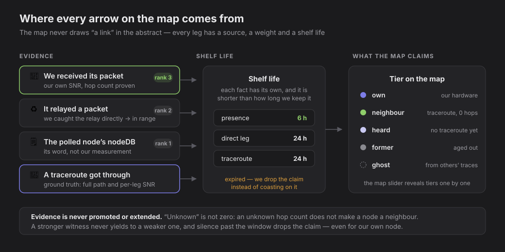

# meshtastic-zoo 📡

**English** | [Русский](README.ru.md)

A live map of your Meshtastic node zoo: who is on the air, who hears
whom and how well, and which node has unread mail. Everything updates
by itself while the page is open.


*(All doc shots are taken in the built-in anonymize mode: neighbours'
names are replaced with their id tails, own nodes' IPs are hidden.)*

Questions, ideas, or a map of your own zoo to show off —
[Discussions](https://github.com/anton-vinogradov/meshtastic-zoo/discussions).

## Running

Quick, for a look:

```sh
python3 -m venv .venv && .venv/bin/pip install -r requirements.txt
.venv/bin/python collector/hub.py
# the map: http://localhost:8814
```

One process does it all: keeps in touch with your nodes, listens to the
air, refreshes the map and serves the site. On first start it creates
`collector/config.json` from `config.example.json` by itself; set your
subnets in ⚙.

What a node needs: to be on the same network (Wi‑Fi or Ethernet) with the
network API on — TCP port 4403. A radio keeps a single TCP client, so the
phone app connected to it over Wi‑Fi will kick the hub off (and the other
way round). Serial and Bluetooth are not supported. Until a node is found,
the map shows which subnets were scanned and where the port is open.

### On a server (systemd)

Put it on an always-on box that can reach your nodes (same LAN). One line —
`install.sh` clones the repo (into `/opt/meshtastic-zoo`), makes a venv,
installs the dependency, seeds `config.json` from `config.example.json`,
and registers a `meshtastic-zoo` systemd service:

```sh
curl -fsSL https://raw.githubusercontent.com/anton-vinogradov/meshtastic-zoo/main/install.sh | bash
# or, running as root:  … | sudo bash
```

Re-run the same line to update (it's idempotent and git-pulls itself). Or,
from a clone (works for a private repo without piping to a shell):

```sh
git clone <repo-url> meshtastic-zoo && cd meshtastic-zoo && ./install.sh
```

The one-liner needs the repo reachable by `git clone` — public, or with a
credential helper configured on the server. `MZ_DIR` sets the install
directory (for example `MZ_DIR=$HOME/meshtastic-zoo`, no rights on `/opt`
needed), `MZ_REPO` the source (your fork). Where root is needed, the
script asks for the `sudo` password.

`config.json` is per-install (git-ignored) and `config.example.json` is a
generic template, so updates never clobber your ⚙ settings. The Telegram
token lives separately in `collector/secrets.json` (mode 0600), and
everything the hub accumulates (node cache, history, conversations) in
`data/`; both are git-ignored too. On first run, set your subnets in the ⚙
panel. Logs: `journalctl -u meshtastic-zoo -f` — they also show the
result of every subnet scan: "🔎 скан 10.0.0.0/24, адресов: 254; порт
4403 открыт: …".

### Who can open the map

There is no login: the hub is meant for a home network. Whoever reaches
port 8814 can read your DMs, transmit from your nodes and change settings.
So don't forward the port to the internet. The `bind` key in
`collector/config.json` sets the address the hub listens on (empty — all
interfaces; the host's LAN address hides the page from VPN and docker
interfaces). Only the site files and `data/live.json` are served: config,
secrets and databases can't be fetched over HTTP.

## What's on the map



Every arrow is a claim, and the map keeps the receipts: what produced it,
how much that source is worth, and when the claim expires. Unknown is never
rounded to zero, a stronger witness never yields to a weaker one, and
silence past the window drops the claim — including for your own node.

- **Node tokens**: a device photo, name and address. Your own nodes are
  tinted **by subnet** — each site gets its own color, which you can
  change in settings; black ones are neighbors heard over the radio. What
  is what — in the legend at the bottom (ⓘ unfolds the key to cards and
  arrows), and the "?" next to it opens a short help.
- **A green dot** — the node is online right now. A "N min / h" badge —
  how long ago it was last heard on the air (orange when older than
  3 hours).
- **Your node without a link to the hub** is dimmed, with a red frame and
  an "offline 9h" badge — even if others still hear it on the air. A
  roaming one gets a grey "roaming" badge. Your battery-powered node shows
  its charge 🔋 right on the card (red at 20% and below).
- **An envelope ✉** — the node has an unread direct message. The
  overall mail counter sits in the top-left corner; clicking it opens
  the node with the letter.
- **A lock 🔒** — the node's public key hasn't been received yet, so an
  encrypted DM to it can't be sent (the `PKI_SEND_FAIL_PUBLIC_KEY`
  error). The key is held **per sending node**: a DM only goes through
  from one of your nodes that already has the recipient's key, so the
  panel lists exactly which of your nodes hold it. Keys arrive on their
  own with NodeInfo; the badge disappears once every node has one. When a
  key is missing, the panel says **why** — the node doesn't publish one
  (old firmware), the entry was evicted from its 250-slot LRU database
  (asking brings it back), or we've never seen it — and offers a
  **request key** button; a background worker also collects keys on its
  own, nearest neighbours first.
- **Show** (on the left of the legend) reveals the map tier by tier: **own** →
  **+trace ✓** (neighbours confirmed by a traceroute that got through, or
  by relaying our own packet) → **+heard** (direct reception exists but
  no confirmation: relayed copies are good at posing as direct, so
  "heard" is not yet "neighbour") → **+former** (grey with a dashed
  frame: now reached over relays — the leg shows a hop count instead of
  an SNR — or gone silent entirely; kept for up to an hour, then
  forgotten) → **+ghosts**. A first visit opens at "+trace ✓", and the
  counter next to it adds up to the number on the map: "11 on the map: own
  4 (3 connected) · neighbours 7", with ghosts as a "show" link.
- **Ghosts 👻** — nodes your fleet never hears at all: they showed up
  inside other people's traceroutes next to nodes whose positions are
  known. A dashed card with a presence age; legs to partners are dashed,
  with no measurement. A click (or tap) opens its panel: when it was
  heard, where the position comes from and whom it was seen next to. If
  the node broadcast its own GPS, that wins over
  our guess (a centroid of partners physically cannot land outside their
  cloud). A day of silence (`ghostWindowH`) and the ghost is gone.
- **Presence.** "Neighbour" is a claim about now: silence longer than 6
  hours (`proofSilentH`, counted across any evidence — reception, a
  traceroute that got through, a relay of our packet) drops the
  confirmation. Your own silent node keeps its own-style card, but its
  legs collapse into a single dashed one — a trace of the last known
  adjacency instead of eight confident arrows.
- **Arrows** show who hears whom: the head points at the listener.
  Color is link quality, from red (barely) to green (ideal). The label
  on the line is the SNR in dB, the measurement age and a **source
  icon**: 📡 we received its packet ourselves · ♻ relay-byte harvest
  (the node relayed someone else's packet and we caught that directly) ·
  🗒 the polled node's own database · 🧭 traceroute · 👥 NeighborInfo ·
  ∅ drawn for symmetry. The exact percentage and the wording are in the
  tooltip; the suffix can be turned off in ⚙. A grey "no data" arrow
  means that direction has never been caught.
- **Distance = quality.** The better a pair hears each other, the
  closer their tokens; nodes with no shared links drift apart. The
  positions come from stress-majorization (weighted MDS) that lays out
  all links at once and finds the best compromise when signal distances
  disagree — two-way and fresh measurements are trusted more. It's a
  connectivity map, not a geographic one: SNR reflects link quality, not
  raw distance (power, antennas and terrain all bend it). Roaming nodes
  get a dashed frame. The map fits the window and re-lays out on resize;
  on a small screen the cards get bigger so a name is never under 10 px.
- **Search 🔍** (top row): matches stay lit, everything else dims — the
  map stays whole and the links stay visible. It searches names,
  callsigns and ids, and understands Cyrillic against transliterated
  names («Богатыр» finds Bogatyrskiy 25). Enter opens the first match,
  Esc clears, «/» focuses the box. The counter is honest: "6 · 8
  filtered out by level" means there are matches the current tier
  doesn't show.


## Hover and click

Hovering over a node highlights its links and dims everything else.
Clicking selects the node — it gets an orange outline, the same dimming
stays put, and the details panel opens. Inside the panel, hovering a
row in **Legs** outlines that neighbor in blue on the map, so you can
tell which card a link goes to. The panel shows:


- device photo and model, ID, callsign, IP, "last seen";
- collapsible detail sections. For your own nodes: **Firmware / Radio /
  Device** — firmware version (with a check against the latest Meshtastic
  release), hop limit, region, modem preset, TX power, battery, uptime,
  WiFi/BT/PKI, rebroadcast mode and more. For neighbors: **Mesh** (hops
  away, whether it came in over MQTT rather than RF, ham license) and
  **Position** (its broadcast coordinates), when that data is available.
  The Geolocation section also shows a **trust class** (A–F) for the
  node's position — from "manually placed" down to "claimed GPS refuted
  by physics"; the measured reasoning behind the whole truth stack lives
  in [docs/truth.md](docs/truth.md);
- **Conversation** — the full message history with this node: incoming
  on the left, your replies on the right. Outgoing messages show a
  delivery status: ⏳ on air → ✓ delivered, ✗ error (with the reason
  spelled out, e.g. "no recipient key") or ⚠ no ack. A failed message has
  a **↻ resend** button; and a "no recipient key" (PKI) failure is handled
  automatically — the hub asks the recipient for its key and retries the
  DM once a few seconds later. A reply goes on the air from the very node
  that was written to (➤), or just mark it as read (✓) — the marker
  clears right away. "Read all" clears the whole conversation at once, and
  "mute" drops the peer from the ✉ counter and from Telegram (handy for
  bots that write every half hour);
- **Heard 24h** — a day strip: at which hours the node was heard and
  how well;
- **traceroute** — a button plus a selector for which of your nodes to
  probe from (or "All, in turn"). The result redraws paths and
  neighbourhood immediately; paths from different own nodes are merged —
  the best fresh one wins — and a non-answer only drops the silent
  pair's path. Several non-answers in a row (`traceFailDrop`) and the
  node loses its neighbour confirmation;
- **Compose** — send a direct message to this node; a selector picks
  which of your nodes speaks (the closest one — that hears the recipient
  loudest — is preselected);
- **Legs** — all the node's links: two-way ones grouped in "there and
  back" pairs (a Δ badge flags direction asymmetry of 6 dB and up),
  one-way ones separately; each measurement carries its age, a source
  icon and an SNR history sparkline.

Every message (in DMs and the channel) can be **reacted to** (tapback
emoji — ＋ opens a picker) and **replied to with a quote** (↩). Each
reaction shows **who placed it**. Incoming reactions and quoted replies
from the mesh are shown the same way. Links in messages are clickable.

## Public channel

A collapsible panel on the left (the 💬 tab) shows the **public channel**
feed — the broadcast messages your nodes hear. Each message lists, right
under it, **which of your nodes received it**, at what SNR, and **how
many hops** it took to reach each one (`0 hop` = heard directly), so you
can see both the coverage and the path of a broadcast at a glance. You
can also post to the channel from any of your online nodes. Drag the
panel's right edge to resize it. It stays collapsed by default; the tab
remembers your choice and the width. A reply or a reaction from the mesh
to your message is mirrored to Telegram (see below).

### Auto-reply to trigger words

When someone posts exactly one of the trigger words (`ping`, `пинг`,
`test`, `тест`, `проверка` by default — the list and the on/off switch
live in ⚙), the hub replies in-thread with which of your nodes heard it
and how far away, one line per group:

```
🏓 напрямую: FCA +9.2, FC1 −7.5
3🐇: FCB
```

The node that heard it best does the replying, since it is the likeliest
to be heard back. If the sender is farther than that node's hop limit,
the reply goes out with enough hops to make it back. Antenna-direction
arrows follow the names when the reply fits into 200 bytes.

**Where it replies.** The reply goes to the channel the ping came from.
Pings in the primary (public) channel are ignored by default: local
meshes ask to keep pings in a service channel. Switch it on with "Answer in
the primary channel" (`pingPrimary`). A ping in a DM always gets a DM
reply, no human needed.

SNR is reported **only for a direct reception**. On a packet that arrived
over relays the SNR describes the last relay's transmitter, not the
sender, so those are collapsed into a hop count.

This costs one packet of airtime: the receptions of that very packet are
already collected. The word has to be the whole message, otherwise the
bot would butt into conversations ("test" is answered, "test from
downtown" is not); case and surrounding punctuation don't matter.
Limits: `pingCooldownS` (600 s) per sender, `pingGapS` (60 s) for the
channel as a whole, silence while channel utilisation is above
`busyChUtil`, and never a reply to a ping from your own nodes — otherwise
two hubs would ping-pong forever. Turn it off with the ⚙ switch (or
`"pingReply": false` in `collector/config.json`).

## The Telegram bridge

Put the bot token and the chat id into `collector/secrets.json` (mode
0600; if they sit in `config.json`, the hub moves them there on start):

```json
{"alerts": {"tgToken": "123456:ABC…", "tgChat": "123456789", "tgProxy": ""}}
```

`tgChat` is one id or several separated by commas. `tgProxy` is a proxy to
Telegram when it isn't reachable directly (`socks5://host:port`). The hub
talks to the Bot API itself through `curl`; no external scripts needed.
From then on it sends to Telegram the things that need your attention —
and only those:

- **incoming DMs** to any of your nodes; replying right in the chat
  sends the answer back into the mesh from the right node;
- **delivery statuses** of your outgoing messages: ✅ delivered · ⏳ the
  recipient doesn't have our key yet (the hub has already asked for it
  and will deliver once the node shows up) · ⚠️ no ack · ❌ failed, with
  the reason;
- **replies and reactions from the public channel to your messages** —
  the channel is not mirrored wholesale, only what's addressed to you,
  by the same rule the UI uses to highlight "replied to you";
- **low battery** on your own node (threshold and hysteresis are
  configurable);
- **your node lost its link to the hub** for more than 15 minutes
  (`ownDownMin`), and when it is back — with how long it was down. Roaming
  nodes don't raise this (`ownDownMobile`).

Each item has its own switch under `alerts`: `dm`, `tgDelivery`,
`tgReply`, `chanReply`, `chanReact`, `lowBatt`, `ownDown`.

Bot commands: `/status` — a summary of how many of your nodes are
connected and who is gone; `/chan <text>` — post to the public channel.

## The status page 📟

The **📟** button opens a service page. It starts with your own nodes:
who is connected, who is gone and for how long (a lost node stays on the
list), charge or "⚡ сеть" on wall power. Then a 24-hour channel-utilization
chart (chUtil — the input of the throttle all on-air workers obey) and,
per worker, what it is doing right now, how long ago its last beat was,
and a daily sparkline of its metric: connections, poll→cache,
cache→map, tiers and precompression, pruning, tracing (background and
own↔own), key collection, geocoding.


## The geo map 🗺

The **🗺** button switches connectivity for real geography (OSM): nodes
with GPS as dots, GPS-less ones as signal-and-crosslink estimates with
an honest uncertainty circle, address-like names geocoded. Every
position carries a trust class A–F; the measured methodology lives in
[docs/truth.md](docs/truth.md). No screenshot here on purpose: it is
the real geography of the sites.

## Nice little things

- SNR labels sit right on their own lines — you can't mix up whose
  number it is.
- Legs try to route around other tokens — bending into an arc and, if
  that isn't enough, attaching at a different edge of the card. Node
  positions never move, so distances stay honest; only the attachment
  points do.
- There are always two arrows between your own nodes. If one direction
  hasn't been caught for a while it is drawn as a grey "no data":
  a one-way link is a suspicious link, and the map pushes such a pair
  farther apart.
- A neighbour confirmation survives 6 hours of silence, the card a day,
  then an hour in grey — and the node is forgotten (all configurable).
- The last scan time is in the legend row; if the data goes stale, a
  warning appears next to it. If the hub stops answering, a banner shows up
  at the top and the map retries every 10 seconds.
- The interface language follows the browser; switch it in the "?" help
  or in ⚙.
- The tab title carries the number of unread messages and lost own nodes
  ("(✉3 ⚠1) meshtastic-zoo"), visible from the background.
- Device photos are the official renders from the Meshtastic project
  (web-flasher); an unknown model gets a placeholder.
- Your message history — both DMs and the channel — is kept on disk and
  survives a hub restart or reboot. Writes are atomic, so a crash in the
  middle of a save can't corrupt or wipe it.
- In any message box, **Enter sends**; what you're typing survives live
  updates (the field isn't cleared under your hands), and text is capped
  at Meshtastic's ~200-byte limit. A reaction shows up immediately as
  "⏳ sending…" and firms up once it's confirmed over the air.

## Settings

The **⚙** button in the top-right corner opens the settings panel. Top to
bottom:

**Weighted map** — stored in the browser, each viewer has their own:

- **Show** — the same level as in the legend: own → +trace ✓ → +heard →
  +former → +ghosts.
- **Geo-oriented** — rotate the layout so your nodes sit where
  they are on the ground (north up); works once at least two of them are
  placed on the geo map.
- **Single points of failure** — for every relay, how many nodes would
  lose the fleet if it went down.
- **Neighbours only when a trace reached them** — the strict mode (on by default): only a
  confirmed node counts as a neighbour, the rest move to "+heard".
- **Age and source on the arrows** — the "· 12m 📡" suffix on leg labels;
  turn it off to declutter the deeper levels.
- **Max neighbors on map** — how many "heard" nodes to draw (top by
  signal; own, confirmed and multi-hop ones are not capped); 0 — all.

**Language** — English or Русский, also in the browser. Defaults to the
browser's language.

Then the shared server config (`collector/config.json`), applied on the
fly with "Save":

- **Site subnets & colors** — where to look for your nodes: a CIDR like
  `10.88.88.0/24`, no wider than /22. A bad line is flagged under the
  field and not saved. Each subnet's card color is stored in the browser.
- **Signal scale** — **0% quality at SNR** and **100% quality at SNR**,
  dB: the arrow color and the distance on the map change smoothly between
  them. The default −20 … +10 dB covers Meshtastic's working range.
- **Node retention on the map** — a **direct neighbor stays** (hours,
  default 24) after the last direct reception, then a **former (grey) stays**
  (default 1) — and the node leaves the map. It stays in the cache exactly
  as long.
- **Polling** — **poll nodes** (seconds, default 30): how often the hub
  polls your nodes; **new-node discovery** (default 60): how often to
  rescan the subnets.
- **Special subnets** — **roaming nodes** (a radio id per line, e.g.
  `!702bde48`): a dashed frame, the address is not trusted and going
  missing raises no alarm; **slow subnets** (an IP prefix per line, e.g.
  `10.77.77.`): nodes that choke on a full database dump get a light poll
  after two failures.
- **History** — the **history chart span**, hours: the window of the
  "nodes on the map" chart in this same panel. It doesn't affect the map or
  the cache.
- **Auto-reply in the channel** — **answer trigger words**, **answer in
  the primary channel**, a **prefix** (roughly where your nodes are, e.g.
  "Bogatyrskiy on air!") and the **trigger words** themselves; details in
  the auto-reply section above.

Rare keys live only in the file: `port` (the nodes' API port, 4403),
`bind` (the address the hub listens on), connect and poll timeouts,
`autoKeyRequest` (on a "no recipient key" DM failure, ask for the key and
retry), `muted` (muted peers, edited with the button in a conversation),
`known` / `names` — fallback IP↔radio-id and name maps for when a node
doesn't answer.

Newer mechanics are file-configured too, in groups: honesty windows
(`proofSilentH`, `ghostWindowH`, `bidirProofH`, `relayProofH`), tracing
(`traceEnabled`, `traceEveryS`, `traceBatch`, `traceHops`, `traceWaitS`,
`traceStaggerS`, `traceCandMin`, `traceFailDrop`, `traceRecheckH`,
`traceLinks`, `traceLinkHours`), key collection (`keyFetchFreshMin`,
`keyFetchHeardMin`, `keySolicitGapS`), relay-byte harvest
(`nbrFromRelay`, `relayResolveMin`), auto-reply (`pingCooldownS`,
`pingGapS`, `pingWaitS`) and Telegram (`alerts.*`). The defaults are tuned
on a live mesh — no need to touch them.

## Roadmap

- [x] Live map with honest distances and device photos
- [x] Mail: unread markers, conversation history, delivery status,
      replying and sending from the right node
- [x] Measurement history and charts: leg sparklines, Heard 24h, status
- [x] Ground-truth neighbourhood: traceroutes, relay-byte harvest,
      presence windows, provenance on every leg
- [x] The Telegram bridge: two-way DMs, delivery statuses, channel
      replies
- [x] A ghost panel: who it is, where the position comes from, whom it was seen next to
- [ ] One-click traceroute to a ghost
- [ ] Position refinement and neighbour re-checks without manual traces
