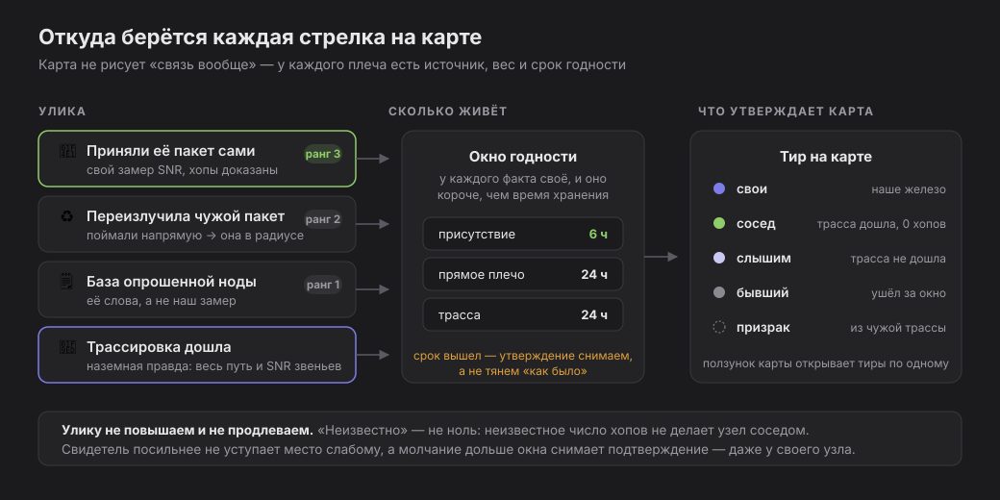

# meshtastic-zoo 📡

[English](README.md) | **Русский**

Живая карта твоего зоопарка Meshtastic-нод: кто в эфире, кто кого слышит
и насколько хорошо, у кого лежит непрочитанное сообщение. Всё обновляется
само, пока страница открыта.


*(Кадры в доке сняты во встроенном анон-режиме: имена соседей заменены
хвостом их id, IP своих нод скрыты.)*

## Запуск

Быстро, посмотреть:

```sh
pip install meshtastic
python3 collector/hub.py
# карта: http://localhost:8814
```

Один процесс делает всё: держит связь с твоими нодами, слушает эфир,
обновляет карту и отдаёт сайт. Какие подсети считать своими — списком
в `collector/config.json`.

### На сервере (systemd)

Ставь на всегда-включённую машину, которая достаёт до нод (та же сеть).
Одной строкой — `install.sh` сам клонирует репозиторий (в
`/opt/meshtastic-zoo`), сделает venv, поставит зависимость, создаст
`config.json` из `config.example.json` и зарегистрирует systemd-сервис
`meshtastic-zoo`:

```sh
curl -fsSL https://raw.githubusercontent.com/anton-vinogradov/meshtastic-zoo/main/install.sh | bash
# или от root:  … | sudo bash
```

Повтори ту же строку для обновления (идемпотентно, `git pull` делается
сам). Либо из клона (работает и для приватного репо, без пайпа в шелл):

```sh
git clone <repo-url> meshtastic-zoo && cd meshtastic-zoo && ./install.sh
```

Однострочнику нужно, чтобы репо клонировался (`git clone`) — публичный
или с настроенным на сервере доступом. `config.json` — свой на каждой
установке (в .gitignore), а `config.example.json` — обобщённый шаблон, так
что ничего приватного в репо не уезжает и обновления не затирают твои
⚙-настройки. При первом запуске задай подсети в панели ⚙.
Логи: `journalctl -u meshtastic-zoo -f`.

## Что на карте



Каждая стрелка — это утверждение, и карта хранит его основание: чем добыто,
сколько эта улика весит и когда протухает. «Неизвестно» никогда не
округляется до нуля, свидетель посильнее не уступает место слабому, а
молчание дольше окна снимает подтверждение — в том числе у своей ноды.

- **Жетоны нод**: фото устройства, имя, адрес. Твои ноды окрашены **по
  подсети** — у каждой площадки свой цвет, его можно менять в настройках;
  чёрные — соседи, слышимые по радио.
- **Зелёная точка** — нода сейчас на связи. Бейдж «N мин / ч» — как
  давно её слышали в эфире (старше 3 часов — оранжевым).
- **Конверт ✉** — на ноде непрочитанное личное сообщение. Общий
  счётчик почты висит в левом верхнем углу; клик по нему открывает
  ноду с письмом.
- **Замок 🔒** — публичный ключ ноды ещё не получен, поэтому
  зашифрованный DM ей не отправить (ошибка `PKI_SEND_FAIL_PUBLIC_KEY`).
  Ключ хранится **у каждой отправляющей ноды свой**: DM пройдёт только с
  той твоей ноды, у которой ключ адресата уже есть, поэтому в панели
  перечислено, у каких именно твоих нод он лежит. Ключи приходят сами с
  NodeInfo; замок исчезает, когда ключ появится у всех. Если ключа нет,
  панель говорит **почему** — нода его не публикует (старая прошивка),
  запись вытеснило из её базы (LRU на 250 узлов — запрос вернёт) или мы
  её ещё не видели — и даёт кнопку **запросить ключ**; фоновый воркер
  добирает ключи сам, ближайшие — в первую очередь.
- **Ползунок детализации** (в ⚙) открывает карту тирами, по одному:
  **свои** → **+трасса ✓** (соседи, подтверждённые дошедшей трассировкой
  или переизлучением нашего пакета) → **+слышим** (прямой приём есть, но
  подтверждения нет: переизлучённые копии умеют притворяться прямыми,
  поэтому «слышим» ещё не «сосед») → **+бывшие** (серые с пунктирной
  рамкой: их теперь достаёт через ретрансляторы — на плече число хопов
  вместо SNR — либо они замолчали совсем; держатся до часа и забываются)
  → **+призраки**.
- **Призраки 👻** — узлы, которых твои ноды не слышат вовсе: они
  засветились внутри чужих трассировок рядом с узлами, чьи позиции
  известны. Пунктирная карточка с возрастом присутствия, пути к
  партнёрам — пунктиром без замера. Если узел сам вещал GPS — берётся
  он, а не наша догадка (центроид партнёров физически не может выйти за
  пределы их облака). Сутки тишины (`ghostWindowH`) — и призрак уходит.
- **Присутствие.** «Сосед» — утверждение о сейчас: молчание дольше 6
  часов (`proofSilentH`; считается по любой улике — приём, дошедшая
  трасса, переизлучение нашего пакета) снимает подтверждение. Своя
  молчащая нода остаётся своей карточкой, но её плечи схлопываются в
  одно пунктирное — след последнего соседства вместо восьми уверенных
  стрелок.
- **Стрелки** показывают, кто кого слышит: остриё — у слушателя.
  Цвет — качество связи, от красного (на грани) до зелёного (идеал).
  Подпись на линии — SNR в децибелах, возраст замера и **значок
  источника**: 📡 приняли её пакет сами · ♻ жатва relay-байта (узел
  переизлучил чужой пакет, и мы поймали это напрямую) · 🗒 база
  опрошенной ноды · 🧭 трассировка · 👥 NeighborInfo · ∅ дорисовано для
  симметрии. Точный процент и расшифровка — в тултипе; суффикс
  отключается тумблером в ⚙. Серая стрелка «нет данных» — это
  направление ни разу не поймано.
- **Расстояние = качество.** Чем лучше пара слышит друг друга, тем
  ближе их жетоны; ноды без общих связей разъезжаются. Позиции считает
  стресс-мажоризация (взвешенный MDS): раскладывает все связи разом и
  находит лучший компромисс, когда дистанции по сигналу противоречат
  друг другу — двусторонним и свежим замерам больше веры. Это карта
  связности, а не географии: SNR отражает качество линка, а не чистое
  расстояние (мощность, антенны и рельеф его искажают). Кочующие ноды —
  пунктирная рамка. Карта вписывается в окно и пересобирается при ресайзе.
- **Поиск 🔍** (верхний ряд): найденное остаётся ярким, остальное гаснет —
  карта цела, и связи видно. Ищет по имени, позывному и id, понимает
  кириллицу против транслита («Богатыр» найдёт Bogatyrskiy 25). Enter
  открывает первое совпадение, Esc сбрасывает, «/» — фокус в поле.
  Счётчик честный: «6 · 8 скрыто уровнем» значит, совпадения есть, но
  текущий тир их не показывает.


## Наведение и клик

Наведение на ноду подсвечивает её связи, всё остальное гаснет.
Клик выбирает ноду — она получает оранжевый контур, затемнение
остаётся, и открывается панель подробностей. В панели наведение на
строку в **Плечах** обводит этого соседа синим на карте, чтобы было
видно, к какой карточке идёт связь. Панель показывает:


- фото и модель железа, ID, позывной, IP, «когда видели»;
- сворачиваемые разделы подробностей. Для своих нод: **Прошивка / Радио /
  Устройство** — версия прошивки (со сверкой с актуальным релизом
  Meshtastic), hop limit, регион, пресет модема, мощность TX, батарея,
  аптайм, WiFi/BT/PKI, режим ретрансляции и прочее. Для соседей: **Сеть**
  (сколько прыжков, пришла ли через MQTT, а не по радио, ham-лицензия) и
  **Позиция** (её broadcast-координаты), когда данные есть. В секции
  «Геолокация» виден **класс доверия** позиции (A–F) — от «размещено
  вручную» до «заявленный GPS опровергнут физикой»; вся измеренная
  логика стека честности — в [docs/truth.ru.md](docs/truth.ru.md);
- **Переписка** — вся история сообщений с этой нодой: входящие слева,
  твои ответы справа. У исходящих виден статус доставки: ⏳ в эфире →
  ✓ доставлено, ✗ ошибка (с расшифровкой причины, например «нет ключа
  адресата») или ⚠ без квитанции. У упавшего сообщения есть кнопка
  **↻ повторить**; а сбой «нет ключа адресата» (PKI) лечится сам — hub
  запрашивает ключ у адресата и через несколько секунд повторяет DM.
  Ответ уходит в эфир именно с той ноды, которой писали (➤), либо просто
  пометь прочитанным (✓) — маркер сразу гаснет;
- **Heard 24h** — полоса суток: в какие часы ноду было слышно и с каким
  качеством;
- **трассировка** — кнопка + выбор, с какой своей ноды пробовать (или
  «Все (по очереди)»). Результат перерисовывает пути и соседство сразу;
  пути от разных твоих нод складываются — наружу идёт лучший свежий, а
  неответ снимает только путь молчавшей пары. Несколько неответов подряд
  (`traceFailDrop`) — и узел теряет подтверждение соседства;
- **Написать** — отправить личное сообщение этой ноде; в селекторе
  выбираешь, от лица какой из твоих нод говорить (по умолчанию —
  ближайшая, та, что слышит адресата громче всех);
- **Плечи** — все связи ноды: двусторонние сгруппированы парами «туда и
  обратно» (Δ-бейдж подсвечивает асимметрию направлений от 6 дБ),
  одиночные отдельно; у каждого замера — возраст, значок источника и
  спарклайн истории SNR.

На любое сообщение (и в личке, и в канале) можно поставить **реакцию**
(эмодзи-тапбэк — ＋ открывает выбор) и **ответить с цитатой** (↩). У
каждой реакции видно, **кто её поставил**. Реакции и ответы-цитаты,
пришедшие из сети, показываются так же. Ссылки в сообщениях кликабельны.

## Публичный канал

Сворачиваемая панель слева (вкладка 💬) показывает ленту **публичного
канала** — широковещательные сообщения, которые слышат твои ноды. Под
каждым сообщением написано, **кто из твоих нод его принял**, с каким SNR
и **за сколько хопов** дошло до каждой (`0 hop` = услышали напрямую) —
сразу видно и охват, и путь broadcast'а. Оттуда же можно написать в
канал от лица любой своей онлайн-ноды. Правый край панели можно тянуть,
меняя её ширину. По умолчанию свёрнута; вкладка помнит и выбор, и ширину. Ответ или
реакция из меша на твоё сообщение зеркалится в Telegram (раздел ниже).

## Телеграм-мост

Заполни `alerts.tgToken` и `alerts.tgChat` в конфиге — hub начнёт слать в
Telegram то, что требует внимания, и только его:

- **входящие DM** на любую твою ноду; реплай на такое сообщение прямо в
  чате уходит обратно в меш от нужной ноды;
- **статусы доставки** исходящих: ✅ доставлено · ⏳ у адресата нет нашего
  ключа (hub сам запросил его и дошлёт, как узел выйдет в эфир) · ⚠️ без
  квитанции · ❌ не доставлено, с причиной;
- **ответы и реакции из публичного канала на твои сообщения** — весь
  канал не зеркалится, только адресованное тебе, по тому же правилу, по
  которому интерфейс подсвечивает «вам ответили»;
- **низкий заряд** своей ноды (порог и гистерезис настраиваются).

Каждый пункт выключается своим ключом в `alerts`: `dm`, `tgDelivery`,
`tgReply`, `chanReply`, `chanReact`, `lowBatt`.

## Страница статуса 📟

Кнопка **📟** — служебная страница: суточный график загрузки канала
(chUtil — вход дросселя всех эфирных воркеров) и по каждому воркеру —
чем он занят прямо сейчас, давность последнего такта и суточный
спарклайн его метрики: соединения, опрос→кеш, кеш→карта, тиры и
предсжатие, чистка, трассировка (фоновая и своя↔своя), добор ключей,
геокодинг.


## Гео-карта 🗺

Кнопка **🗺** переключает связность на настоящую географию (OSM): ноды с
GPS — точками, GPS-less — оценкой по сигналу и чужим звеньям с честным
кругом неопределённости, адреса из имён — геокодингом. У каждой позиции
— класс доверия A–F; вся измеренная методика — в
[docs/truth.ru.md](docs/truth.ru.md). Скриншота здесь нет намеренно: это
реальная география площадок.

## Мелочи, которые приятно знать

- Подписи SNR лежат прямо на своих линиях — не перепутаешь, чьё число.
- Плечи стараются обходить чужие жетоны — выгибаются дугой, а если
  этого мало, цепляются к другой грани карточки. Позиции узлов при этом
  не двигаются, так что честность расстояний не страдает — двигаются
  только точки крепления.
- Между твоими нодами всегда две стрелки. Если одно направление давно
  не ловилось, оно рисуется серым «нет данных»: односторонняя связь —
  подозрительная связь, и карта отодвигает такую пару подальше.
- Подтверждение соседства живёт 6 часов тишины, карточка — сутки, потом
  час серым — и узел забывается (всё настраивается).
- Время последнего обновления — в правом нижнем углу; если данные
  протухли, рядом появится пометка.
- Фото устройств — официальные рендеры проекта Meshtastic
  (web-flasher); незнакомая модель получает заглушку.
- История сообщений — и личка, и канал — хранится на диске и переживает
  перезапуск hub'а и перезагрузку. Запись атомарная, поэтому краш посреди
  сохранения её не побьёт и не сотрёт.
- В любом поле ввода **Enter — отправить**; набранное переживает живые
  обновления (поле не очищается под руками), а текст ограничен ~200
  байтами (лимит Meshtastic). Реакция сразу показывается как «⏳
  отправляется…» и закрепляется, когда подтвердится в эфире.

## Настройки

Кнопка **⚙** в правом верхнем углу карты открывает панель настроек.
Каждое поле, сверху вниз:

- **Язык** — язык интерфейса, English или Русский. Хранится в браузере
  (не на сервере), так что каждый смотрящий выбирает свой.
- **Подсети площадок** — IP-подсети, которые сборщик сканирует в поисках
  нод; каждая строка — CIDR (например `10.88.88.0/24`) со своим **цветом
  карточек**. ＋ добавляет подсеть, × удаляет. Сами подсети — общий
  конфиг, а цвета хранятся в браузере и применяются мгновенно, так что у
  каждого смотрящего свой.
- **0% качества при SNR, дБ** — SNR, который цветовая шкала считает
  худшим (0%, красный). Плечи с таким и ниже SNR — полностью красные.
- **100% качества при SNR, дБ** — SNR, считающийся идеальным (100%,
  зелёный). Между этими двумя значениями плавно меняются и цвет, и
  расстояние на карте. Дефолт −20 … +10 дБ покрывает рабочий диапазон
  Meshtastic; сузь его, чтобы раскраска стала строже.
- **Держать молчащего соседа, часов** — сколько держать внешнюю ноду на
  карте после того, как её последний раз слышали в эфире. Уменьши (1–2 ч),
  чтобы на карте были только активные сейчас; увеличь, чтобы помнить
  редких.
- **Помнить плечи в кэше, часов** — сколько переиспользовать последний
  замер SNR плеча, если нода доступна, но в этот раз про это плечо не
  сообщила (например, ответила лёгким опросом). Спасает карту от
  мерцания; данные не выдумывает, только держит последнее реальное
  измерение.
- **Обновление карты, секунд** — как часто карта пересобирается из живых
  баз нод. Дефолт 60 с.
- **Поиск новых нод, секунд** — как часто подсети пересканируются на
  предмет только что появившихся нод. Дефолт 300 с.
- **Кочующие ноды** — radio-id (по одному на строку, например
  `!702bde48`) нод, которые перемещаются и меняют IP; они получают
  пунктирную рамку, чтобы ты не доверял их адресу.
- **Медленные подсети** — IP-префиксы (по одному на строку, например
  `10.77.77.`) площадок, чьи ноды захлёбываются, когда с них тянут всю
  базу узлов разом. Такие сборщик опрашивает облегчённо после двух
  неудачных полных попыток. Тонкая настройка — оставь пустой, если
  площадка не отваливается по таймауту.
- **Уровень детализации** — тот самый ползунок тиров: свои → +трасса ✓ →
  +слышим → +бывшие → +призраки.
- **Ориентация по географии** — повернуть раскладку так, чтобы взаимное
  расположение своих нод совпало с реальным (север сверху); работает,
  когда хотя бы две своих размещены на гео-карте.
- **⚠ Критичность** — подсветить единые точки отказа: у каждого
  ретранслятора посчитано, сколько нод потеряют связь с флотом, если он
  выключится.
- **🧭 Соседи только по трассе** — строгий режим тира соседей (по
  умолчанию вкл): соседом считается только подтверждённый узел;
  неподтверждённые не исчезают, а уезжают в тир «+слышим».
- **🕐 Возраст и источник на стрелках** — суффикс «· 12м 📡» на подписях
  плеч; выключи, чтобы разгрузить глубокие уровни.
- **Лимит нод** — сколько «слышимых» рисовать (топ по силе сигнала;
  своих, подтверждённых и многохоповых лимит не трогает); 0 — все.

Изменения применяются на лету и сохраняются в `collector/config.json`.
Пара редких ключей живёт только в файле: `port` (порт API нод, 4403),
таймауты подключения/опроса, `hopMaxShow` (максимальное число хопов, на
котором ретранслируемый бывший сосед ещё показывается, прежде чем его
отбросят как шум маршрутизации — по умолчанию 7), `hopSettleMin` (сколько
минут без прямого приёма должно пройти, прежде чем сползший сосед станет
серым, чтобы игнорировать мгновенные флапы — по умолчанию 3),
`hopStaleMin` (сколько держать серую многохоповую ноду, прежде чем
забыть — по умолчанию 60), `autoKeyRequest` (при сбое DM «нет ключа
адресата» запросить ключ у адресата и повторить раз — по умолчанию вкл)
и `keyRetryS` (через сколько секунд повторить — по умолчанию 12) и
`known` / `names` — запасные карты IP↔radio-id и имён на случай, если
нода не отвечает.

Новые механики тоже настраиваются файлом, группами: окна честности
(`proofSilentH`, `ghostWindowH`, `directWindowH`, `formerWindowH`,
`bidirProofH`, `relayProofH`), трассировка (`traceEnabled`, `traceEveryS`,
`traceBatch`, `traceHops`, `traceWaitS`, `traceStaggerS`, `traceCandMin`,
`traceFailDrop`, `traceRecheckH`, `traceLinks`, `traceLinkHours`), добор
ключей (`keyFetchFreshMin`, `keyFetchHeardMin`, `keySolicitGapS`), жатва
relay-байта (`nbrFromRelay`, `relayResolveMin`) и телеграм (`alerts.*`).
Дефолты подобраны по замерам живой сети — трогать не обязательно.

## Дорожная карта

- [x] Живая карта с честными дистанциями и фото устройств
- [x] Почта: маркеры непрочитанного, история переписки, статус
      доставки, ответ и отправка с нужной ноды
- [x] История измерений и графики: спарклайны плеч, Heard 24h, статус
- [x] Соседство по наземной правде: трассировки, жатва relay-байта,
      окна присутствия, происхождение каждого плеча
- [x] Телеграм-мост: DM в обе стороны, статусы доставки, ответы из
      публичного канала
- [ ] Панель призрака: партнёры, история, трассировка одним кликом
- [ ] Уточнение позиций и перепроверка соседей без ручных трасс
