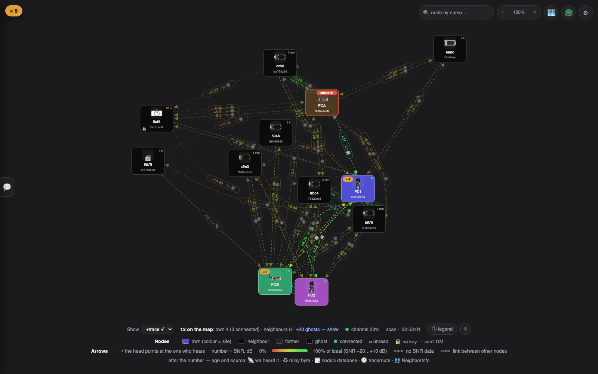
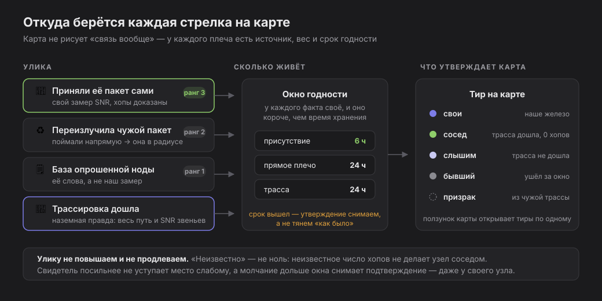
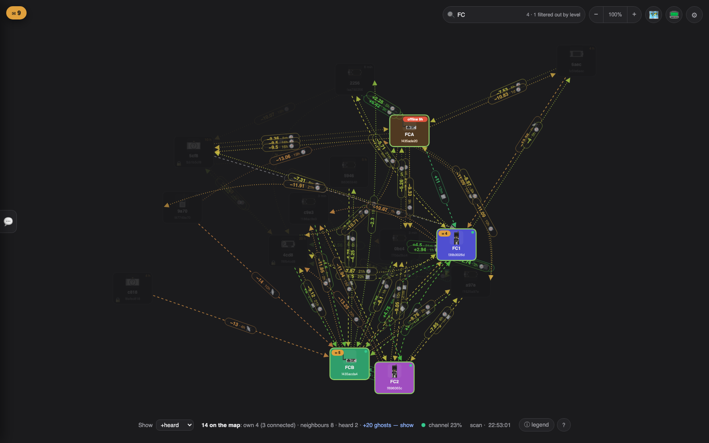
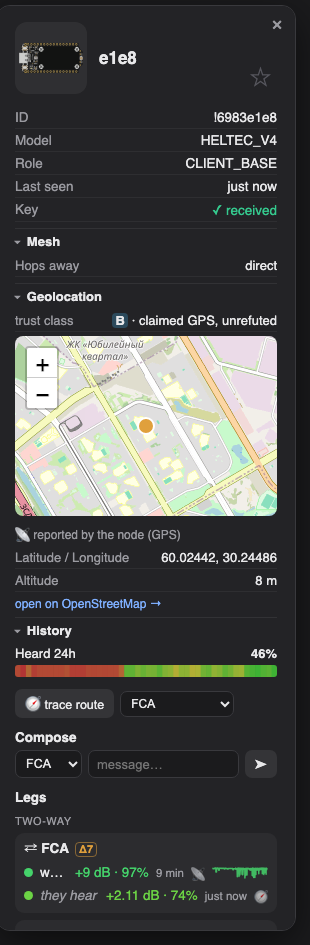
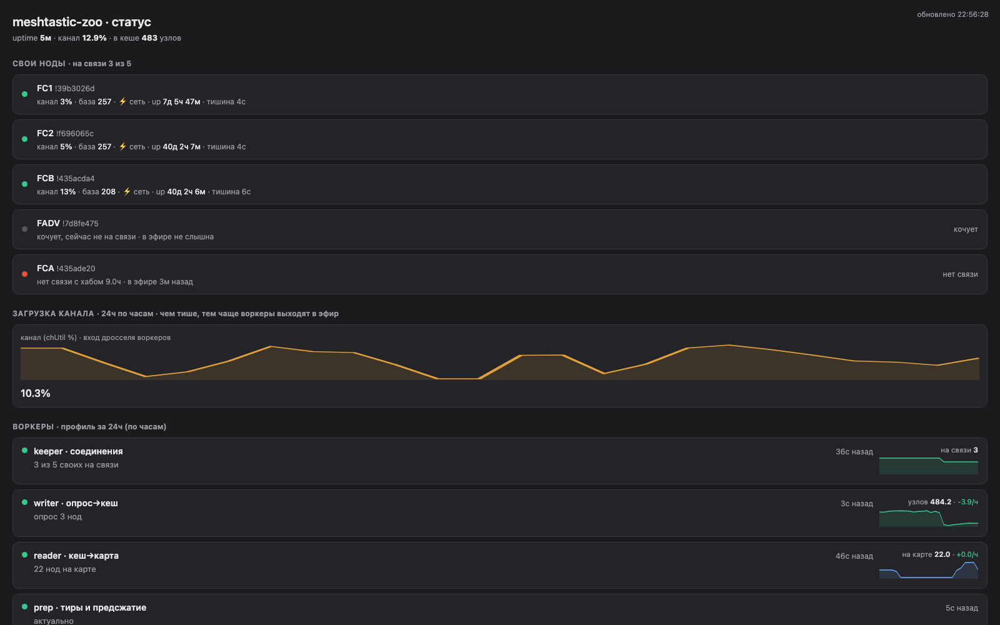

# meshtastic-zoo 📡

[English](README.md) | **Русский**

Живая карта твоего зоопарка Meshtastic-нод: кто в эфире, кто кого слышит
и насколько хорошо, у кого лежит непрочитанное сообщение. Всё обновляется
само, пока страница открыта.



*(Кадры в доке сняты во встроенном анон-режиме: имена соседей заменены
хвостом их id, IP своих нод скрыты.)*

Вопросы, идеи или карта своего зоопарка —
в [Обсуждения](https://github.com/anton-vinogradov/meshtastic-zoo/discussions).

## Запуск

Быстро, посмотреть:

```sh
python3 -m venv .venv && .venv/bin/pip install -r requirements.txt
.venv/bin/python collector/hub.py
# карта: http://localhost:8814
```

Один процесс делает всё: держит связь с твоими нодами, слушает эфир,
обновляет карту и отдаёт сайт. При первом запуске он сам создаст
`collector/config.json` из `config.example.json`; свои подсети задай в ⚙.

Что нужно от ноды: она в той же сети (Wi‑Fi или Ethernet) с включённым
сетевым API — TCP-порт 4403. Рация держит одного TCP-клиента, поэтому
приложение на телефоне, подключённое к ней по Wi‑Fi, выбьет hub (и
наоборот). Serial и Bluetooth hub не умеет. Пока ни одна нода не нашлась,
карта показывает, какие подсети просканированы и где открыт порт.

### На сервере (systemd)

Ставь на всегда-включённую машину, которая достаёт до нод (та же сеть).
Одной строкой — `install.sh` сам клонирует репозиторий (в
`/opt/meshtastic-zoo`), сделает venv, поставит зависимость, создаст
`config.json` из `config.example.json` и зарегистрирует systemd-сервис
`meshtastic-zoo`:

```sh
curl -fsSL https://raw.githubusercontent.com/anton-vinogradov/meshtastic-zoo/main/install.sh | bash
# или от root:  … | sudo bash
```

Повтори ту же строку для обновления (идемпотентно, `git pull` делается
сам). Либо из клона (работает и для приватного репо, без пайпа в шелл):

```sh
git clone <repo-url> meshtastic-zoo && cd meshtastic-zoo && ./install.sh
```

Однострочнику нужно, чтобы репо клонировался (`git clone`) — публичный
или с настроенным на сервере доступом. Каталог задаёт `MZ_DIR` (например,
`MZ_DIR=$HOME/meshtastic-zoo` — без прав на `/opt`), источник — `MZ_REPO`
(свой форк). Где нужен root, скрипт спросит пароль `sudo`.

`config.json` — свой на каждой установке (в .gitignore), а
`config.example.json` — обобщённый шаблон, так что обновления не затирают
твои ⚙-настройки. Токен Telegram лежит отдельно, в `collector/secrets.json`
(права 0600), а всё, что hub накапливает (кеш нод, история, переписка), — в
`data/`; оба тоже в .gitignore. При первом запуске задай подсети в панели ⚙.
Логи: `journalctl -u meshtastic-zoo -f` — там видно и итог каждого скана
подсетей: «🔎 скан 10.0.0.0/24, адресов: 254; порт 4403 открыт: …».

### Кто может открыть карту

Входа нет: hub рассчитан на домашнюю сеть. Кто достаёт до порта 8814, тот
читает личку, пишет в эфир от твоих нод и меняет настройки. Поэтому порт не
пробрасывай в интернет. Ключ `bind` в `collector/config.json` задаёт адрес,
на котором hub слушает (пусто — все интерфейсы; LAN-адрес хоста закроет
страницу от VPN- и docker-интерфейсов). Наружу отдаются только файлы сайта
и `data/live.json`: конфиг, секреты и базы по HTTP не достать.

## Что на карте



Каждая стрелка — это утверждение, и карта хранит его основание: чем добыто,
сколько эта улика весит и когда протухает. «Неизвестно» никогда не
округляется до нуля, свидетель посильнее не уступает место слабому, а
молчание дольше окна снимает подтверждение — в том числе у своей ноды.

- **Жетоны нод**: фото устройства, имя, адрес. Твои ноды окрашены **по
  подсети** — у каждой площадки свой цвет, его можно менять в настройках;
  чёрные — соседи, слышимые по радио. Подсказка, что есть что, — в
  легенде внизу (ⓘ разворачивает ключ к карточкам и стрелкам), а «?» рядом
  открывает короткую справку.
- **Зелёная точка** — нода сейчас на связи. Бейдж «N мин / ч» — как
  давно её слышали в эфире (старше 3 часов — оранжевым).
- **Своя нода без связи с hub'ом** приглушена, с красной рамкой и плашкой
  «нет связи 9 ч» — даже если её слышат в эфире другие. Кочующая получает
  серую плашку «кочует». Своя нода на батарее показывает заряд 🔋 прямо на
  карточке (от 20% и ниже — красным).
- **Конверт ✉** — на ноде непрочитанное личное сообщение. Общий
  счётчик почты висит в левом верхнем углу; клик по нему открывает
  ноду с письмом.
- **Замок 🔒** — публичный ключ ноды ещё не получен, поэтому
  зашифрованный DM ей не отправить (ошибка `PKI_SEND_FAIL_PUBLIC_KEY`).
  Ключ хранится **у каждой отправляющей ноды свой**: DM пройдёт только с
  той твоей ноды, у которой ключ адресата уже есть, поэтому в панели
  перечислено, у каких именно твоих нод он лежит. Ключи приходят сами с
  NodeInfo; замок исчезает, когда ключ появится у всех. Если ключа нет,
  панель говорит **почему** — нода его не публикует (старая прошивка),
  запись вытеснило из её базы (LRU на 250 узлов — запрос вернёт) или мы
  её ещё не видели — и даёт кнопку **запросить ключ**; фоновый воркер
  добирает ключи сам, ближайшие — в первую очередь.
- **Показ** (слева в легенде) открывает карту тирами, по одному:
  **свои** → **+трасса ✓** (соседи, подтверждённые дошедшей трассировкой
  или переизлучением нашего пакета) → **+слышим** (прямой приём есть, но
  подтверждения нет: переизлучённые копии умеют притворяться прямыми,
  поэтому «слышим» ещё не «сосед») → **+бывшие** (серые с пунктирной
  рамкой: их теперь достаёт через ретрансляторы — на плече число хопов
  вместо SNR — либо они замолчали совсем; держатся до часа и забываются)
  → **+призраки**. Первый заход открывается на «+трасса ✓», а счётчик
  рядом складывается в число узлов на карте: «на карте 11: свои 4 (3 на
  связи) · соседи 7», призраки — ссылкой «показать».
- **Призраки 👻** — узлы, которых твои ноды не слышат вовсе: они
  засветились внутри чужих трассировок рядом с узлами, чьи позиции
  известны. Пунктирная карточка с возрастом присутствия, пути к
  партнёрам — пунктиром без замера. Клик (или тап) открывает панель:
  когда слышали, откуда позиция и рядом с кем его видели. Если узел сам вещал GPS — берётся
  он, а не наша догадка (центроид партнёров физически не может выйти за
  пределы их облака). Сутки тишины (`ghostWindowH`) — и призрак уходит.
- **Присутствие.** «Сосед» — утверждение о сейчас: молчание дольше 6
  часов (`proofSilentH`; считается по любой улике — приём, дошедшая
  трасса, переизлучение нашего пакета) снимает подтверждение. Своя
  молчащая нода остаётся своей карточкой, но её плечи схлопываются в
  одно пунктирное — след последнего соседства вместо восьми уверенных
  стрелок.
- **Стрелки** показывают, кто кого слышит: остриё — у слушателя.
  Цвет — качество связи, от красного (на грани) до зелёного (идеал).
  Подпись на линии — SNR в децибелах, возраст замера и **значок
  источника**: 📡 приняли её пакет сами · ♻ жатва relay-байта (узел
  переизлучил чужой пакет, и мы поймали это напрямую) · 🗒 база
  опрошенной ноды · 🧭 трассировка · 👥 NeighborInfo · ∅ дорисовано для
  симметрии. Точный процент и расшифровка — в тултипе; суффикс
  отключается тумблером в ⚙. Серая стрелка «нет данных» — это
  направление ни разу не поймано.
- **Расстояние = качество.** Чем лучше пара слышит друг друга, тем
  ближе их жетоны; ноды без общих связей разъезжаются. Позиции считает
  стресс-мажоризация (взвешенный MDS): раскладывает все связи разом и
  находит лучший компромисс, когда дистанции по сигналу противоречат
  друг другу — двусторонним и свежим замерам больше веры. Это карта
  связности, а не географии: SNR отражает качество линка, а не чистое
  расстояние (мощность, антенны и рельеф его искажают). Кочующие ноды —
  пунктирная рамка. Карта вписывается в окно и пересобирается при ресайзе;
  на маленьком экране карточки крупнее, чтобы имя было не мельче 10 px.
- **Поиск 🔍** (верхний ряд): найденное остаётся ярким, остальное гаснет —
  карта цела, и связи видно. Ищет по имени, позывному и id, понимает
  кириллицу против транслита («Богатыр» найдёт Bogatyrskiy 25). Enter
  открывает первое совпадение, Esc сбрасывает, «/» — фокус в поле.
  Счётчик честный: «6 · 8 скрыто уровнем» значит, совпадения есть, но
  текущий тир их не показывает.



## Наведение и клик

Наведение на ноду подсвечивает её связи, всё остальное гаснет.
Клик выбирает ноду — она получает оранжевый контур, затемнение
остаётся, и открывается панель подробностей. В панели наведение на
строку в **Плечах** обводит этого соседа синим на карте, чтобы было
видно, к какой карточке идёт связь. Панель показывает:



- фото и модель железа, ID, позывной, IP, «когда видели»;
- сворачиваемые разделы подробностей. Для своих нод: **Прошивка / Радио /
  Устройство** — версия прошивки (со сверкой с актуальным релизом
  Meshtastic), hop limit, регион, пресет модема, мощность TX, батарея,
  аптайм, WiFi/BT/PKI, режим ретрансляции и прочее. Для соседей: **Сеть**
  (сколько прыжков, пришла ли через MQTT, а не по радио, ham-лицензия) и
  **Позиция** (её broadcast-координаты), когда данные есть. В секции
  «Геолокация» виден **класс доверия** позиции (A–F) — от «размещено
  вручную» до «заявленный GPS опровергнут физикой»; вся измеренная
  логика стека честности — в [docs/truth.ru.md](docs/truth.ru.md);
- **Переписка** — вся история сообщений с этой нодой: входящие слева,
  твои ответы справа. У исходящих виден статус доставки: ⏳ в эфире →
  ✓ доставлено, ✗ ошибка (с расшифровкой причины, например «нет ключа
  адресата») или ⚠ без квитанции. У упавшего сообщения есть кнопка
  **↻ повторить**; а сбой «нет ключа адресата» (PKI) лечится сам — hub
  запрашивает ключ у адресата и через несколько секунд повторяет DM.
  Ответ уходит в эфир именно с той ноды, которой писали (➤), либо просто
  пометь прочитанным (✓) — маркер сразу гаснет. «Прочитать всё» гасит всю
  переписку разом, а «заглушить» убирает собеседника из счётчика ✉ и из
  Telegram (удобно для ботов, которые пишут каждые полчаса);
- **Heard 24h** — полоса суток: в какие часы ноду было слышно и с каким
  качеством;
- **трассировка** — кнопка + выбор, с какой своей ноды пробовать (или
  «Все (по очереди)»). Результат перерисовывает пути и соседство сразу;
  пути от разных твоих нод складываются — наружу идёт лучший свежий, а
  неответ снимает только путь молчавшей пары. Несколько неответов подряд
  (`traceFailDrop`) — и узел теряет подтверждение соседства;
- **Написать** — отправить личное сообщение этой ноде; в селекторе
  выбираешь, от лица какой из твоих нод говорить (по умолчанию —
  ближайшая, та, что слышит адресата громче всех);
- **Плечи** — все связи ноды: двусторонние сгруппированы парами «туда и
  обратно» (Δ-бейдж подсвечивает асимметрию направлений от 6 дБ),
  одиночные отдельно; у каждого замера — возраст, значок источника и
  спарклайн истории SNR.

На любое сообщение (и в личке, и в канале) можно поставить **реакцию**
(эмодзи-тапбэк — ＋ открывает выбор) и **ответить с цитатой** (↩). У
каждой реакции видно, **кто её поставил**. Реакции и ответы-цитаты,
пришедшие из сети, показываются так же. Ссылки в сообщениях кликабельны.

## Публичный канал

Сворачиваемая панель слева (вкладка 💬) показывает ленту **публичного
канала** — широковещательные сообщения, которые слышат твои ноды. Под
каждым сообщением написано, **кто из твоих нод его принял**, с каким SNR
и **за сколько хопов** дошло до каждой (`0 hop` = услышали напрямую) —
сразу видно и охват, и путь broadcast'а. Оттуда же можно написать в
канал от лица любой своей онлайн-ноды. Правый край панели можно тянуть,
меняя её ширину. По умолчанию свёрнута; вкладка помнит и выбор, и ширину. Ответ или
реакция из меша на твоё сообщение зеркалится в Telegram (раздел ниже).

### Автоответ на слова-триггеры

Если кто-то пишет ровно одно из слов-триггеров (по умолчанию `ping`,
`пинг`, `test`, `тест`, `проверка` — список правится в ⚙, там же тумблер
включения), хаб отвечает реплаем: какие твои ноды его услышали и как
далеко, каждая группа своей строкой:

```
🏓 напрямую: FCA +9.2, FC1 −7.5
3🐇: FCB
```

Отвечает нода, услышавшая лучше всех: её вероятнее услышат в ответ. Если
пингующий дальше, чем hop limit этой ноды, ответ уходит с запасом хопов,
чтобы долетел. После имён — стрелки направления антенн, если ответ
влезает в 200 байт.

**Куда отвечаем.** Ответ уходит в тот канал, откуда пришёл ping. На пинги
в основном (публичном) канале бот по умолчанию молчит: местные меши
просят держать пинги в сервисном канале. Включается тумблером «Отвечать в
основном канале» (`pingPrimary`). Ping в личку всегда получает ответ в
личку, без участия человека.

SNR показывается **только для прямого приёма**. У пакета, дошедшего через
ретрансляторы, SNR описывает передатчик последнего реле, а не отправителя,
поэтому такие приёмы сворачиваются в число хопов.

Эфира на это тратится один пакет: приёмы того же пакета уже собраны. Слово
должно быть сообщением целиком, иначе бот влезал бы в живой разговор
(«тест» ответ получит, «тест связи из центра» — нет); регистр и знаки
вокруг не важны. Ограничители: пауза `pingCooldownS` (600 с) на одного
отправителя, `pingGapS` (60 с) на канал в целом, молчание при загрузке
канала выше `busyChUtil`, и никогда не отвечаем на ping своих же нод —
иначе два хаба перепингуют друг друга. Выключается тумблером в ⚙ (или
`"pingReply": false` в `collector/config.json`).

## Телеграм-мост

Положи токен бота и id чата в `collector/secrets.json` (права 0600; если
они лежат в `config.json`, hub при старте сам перенесёт их туда):

```json
{"alerts": {"tgToken": "123456:ABC…", "tgChat": "123456789", "tgProxy": ""}}
```

`tgChat` — один id или несколько через запятую. `tgProxy` — прокси до
Telegram, если напрямую он недоступен (`socks5://host:port`). Hub ходит в
Bot API сам через `curl`, внешние скрипты не нужны. После этого он шлёт в
Telegram то, что требует внимания, и только его:

- **входящие DM** на любую твою ноду; реплай на такое сообщение прямо в
  чате уходит обратно в меш от нужной ноды;
- **статусы доставки** исходящих: ✅ доставлено · ⏳ у адресата нет нашего
  ключа (hub сам запросил его и дошлёт, как узел выйдет в эфир) · ⚠️ без
  квитанции · ❌ не доставлено, с причиной;
- **ответы и реакции из публичного канала на твои сообщения** — весь
  канал не зеркалится, только адресованное тебе, по тому же правилу, по
  которому интерфейс подсвечивает «вам ответили»;
- **низкий заряд** своей ноды (порог и гистерезис настраиваются);
- **своя нода потеряла связь с hub'ом** дольше 15 минут (`ownDownMin`) и
  когда вернулась — с длительностью простоя. Кочующие ноды не тревожат
  (`ownDownMobile`).

Каждый пункт выключается своим ключом в `alerts`: `dm`, `tgDelivery`,
`tgReply`, `chanReply`, `chanReact`, `lowBatt`, `ownDown`.

Команды боту: `/status` — сводка, сколько своих нод на связи и кто
пропал; `/chan <текст>` — написать в общий канал.

## Страница статуса 📟

Кнопка **📟** — служебная страница. Первым идёт список своих нод: кто на
связи, кто пропал и как давно (пропавшая не исчезает из списка), заряд или
«⚡ сеть». Дальше — суточный график загрузки канала
(chUtil — вход дросселя всех эфирных воркеров) и по каждому воркеру —
чем он занят прямо сейчас, давность последнего такта и суточный
спарклайн его метрики: соединения, опрос→кеш, кеш→карта, тиры и
предсжатие, чистка, трассировка (фоновая и своя↔своя), добор ключей,
геокодинг.



## Гео-карта 🗺

Кнопка **🗺** переключает связность на настоящую географию (OSM): ноды с
GPS — точками, GPS-less — оценкой по сигналу и чужим звеньям с честным
кругом неопределённости, адреса из имён — геокодингом. У каждой позиции
— класс доверия A–F; вся измеренная методика — в
[docs/truth.ru.md](docs/truth.ru.md). Скриншота здесь нет намеренно: это
реальная география площадок.

## Мелочи, которые приятно знать

- Подписи SNR лежат прямо на своих линиях — не перепутаешь, чьё число.
- Плечи стараются обходить чужие жетоны — выгибаются дугой, а если
  этого мало, цепляются к другой грани карточки. Позиции узлов при этом
  не двигаются, так что честность расстояний не страдает — двигаются
  только точки крепления.
- Между твоими нодами всегда две стрелки. Если одно направление давно
  не ловилось, оно рисуется серым «нет данных»: односторонняя связь —
  подозрительная связь, и карта отодвигает такую пару подальше.
- Подтверждение соседства живёт 6 часов тишины, карточка — сутки, потом
  час серым — и узел забывается (всё настраивается).
- Время последнего скана — в строке легенды; если данные протухли, рядом
  появится пометка. Если hub перестал отвечать, сверху появится плашка, а
  карта будет переспрашивать каждые 10 секунд.
- Язык интерфейса берётся из браузера; переключается в справке «?» и в ⚙.
- В заголовке вкладки — число непрочитанных и пропавших своих нод
  («(✉3 ⚠1) meshtastic-zoo»), видно и из фона.
- Фото устройств — официальные рендеры проекта Meshtastic
  (web-flasher); незнакомая модель получает заглушку.
- История сообщений — и личка, и канал — хранится на диске и переживает
  перезапуск hub'а и перезагрузку. Запись атомарная, поэтому краш посреди
  сохранения её не побьёт и не сотрёт.
- В любом поле ввода **Enter — отправить**; набранное переживает живые
  обновления (поле не очищается под руками), а текст ограничен ~200
  байтами (лимит Meshtastic). Реакция сразу показывается как «⏳
  отправляется…» и закрепляется, когда подтвердится в эфире.

## Настройки

Кнопка **⚙** в правом верхнем углу открывает панель настроек. Сверху вниз:

**Карта весов** — хранится в браузере, у каждого смотрящего своя:

- **Показ** — тот же уровень, что и в легенде: свои → +трасса ✓ →
  +слышим → +бывшие → +призраки.
- **По географии** — повернуть раскладку так, чтобы взаимное расположение
  своих нод совпало с реальным (север сверху); работает, когда хотя бы две
  своих размещены на гео-карте.
- **Единые точки отказа** — у каждого ретранслятора посчитано, сколько нод
  потеряют связь с флотом, если он выключится.
- **Соседи только по трассе** — строгий режим (по умолчанию вкл):
  соседом считается только подтверждённый узел, неподтверждённые уезжают
  в тир «+слышим».
- **Возраст и источник на стрелках** — суффикс «· 12м 📡» на подписях
  плеч; выключи, чтобы разгрузить глубокие уровни.
- **Макс. соседей на карте** — сколько «слышимых» рисовать (топ по силе
  сигнала; своих, подтверждённых и многохоповых лимит не трогает); 0 — все.

**Язык** — English или Русский, тоже в браузере. По умолчанию — язык
браузера.

Дальше — общий конфиг сервера (`collector/config.json`), применяется на
лету по кнопке «Сохранить»:

- **Подсети площадок и цвета** — где искать свои ноды: CIDR вида
  `10.88.88.0/24`, не шире /22. Ошибка в строке подсвечивается под полем и
  не сохраняется. Цвет карточек у каждой подсети свой и хранится в
  браузере.
- **Шкала сигнала** — **0% качества при SNR** и **100% качества при SNR**,
  дБ: между ними плавно меняются цвет стрелки и расстояние на карте.
  Дефолт −20 … +10 дБ покрывает рабочий диапазон Meshtastic.
- **Удержание нод на карте** — **прямой сосед держится** (часов, дефолт 24)
  после последнего прямого приёма, затем **бывший (серый) держится** (дефолт
  1) — и узел уходит с карты. Ровно столько же он лежит в кеше.
- **Опрос** — **опрос нод** (секунд, дефолт 30): как часто hub опрашивает
  свои ноды; **поиск новых нод** (дефолт 60): как часто пересканировать
  подсети.
- **Особые подсети** — **кочующие ноды** (radio-id по одному на строку,
  например `!702bde48`): пунктирная рамка, адресу не доверяем, пропажа не
  тревожит; **медленные подсети** (IP-префикс на строке, например
  `10.77.77.`): ноды, которые захлёбываются от полной выгрузки базы, после
  двух неудач опрашиваются облегчённо.
- **История** — **окно графика истории**, часов: за сколько строится
  график «узлов на карте» в этой же панели. На карту и кеш не влияет.
- **Автоответ в канале** — **отвечать на слова-триггеры**, **отвечать в
  основном канале**, **префикс** (где примерно стоят ноды, например
  «Богатырский на связи!») и сами **слова-триггеры**; подробности — в
  разделе про автоответ выше.

Редкие ключи живут только в файле: `port` (порт API нод, 4403), `bind`
(адрес, на котором слушает hub), таймауты подключения и опроса,
`autoKeyRequest` (при сбое DM «нет ключа адресата» запросить ключ и
повторить), `muted` (заглушённые собеседники, правится кнопкой в
переписке), `known` / `names` — запасные карты IP↔radio-id и имён на
случай, если нода не отвечает.

Новые механики тоже настраиваются файлом, группами: окна честности
(`proofSilentH`, `ghostWindowH`, `bidirProofH`, `relayProofH`),
трассировка (`traceEnabled`, `traceEveryS`, `traceBatch`, `traceHops`,
`traceWaitS`, `traceStaggerS`, `traceCandMin`, `traceFailDrop`,
`traceRecheckH`, `traceLinks`, `traceLinkHours`), добор ключей
(`keyFetchFreshMin`, `keyFetchHeardMin`, `keySolicitGapS`), жатва
relay-байта (`nbrFromRelay`, `relayResolveMin`), автоответ (`pingCooldownS`,
`pingGapS`, `pingWaitS`) и телеграм (`alerts.*`). Дефолты подобраны по
замерам живой сети — трогать не обязательно.

## Дорожная карта

- [x] Живая карта с честными дистанциями и фото устройств
- [x] Почта: маркеры непрочитанного, история переписки, статус
      доставки, ответ и отправка с нужной ноды
- [x] История измерений и графики: спарклайны плеч, Heard 24h, статус
- [x] Соседство по наземной правде: трассировки, жатва relay-байта,
      окна присутствия, происхождение каждого плеча
- [x] Телеграм-мост: DM в обе стороны, статусы доставки, ответы из
      публичного канала
- [x] Панель призрака: кто он, откуда позиция, рядом с кем видели
- [ ] Трассировка до призрака одним кликом
- [ ] Уточнение позиций и перепроверка соседей без ручных трасс
